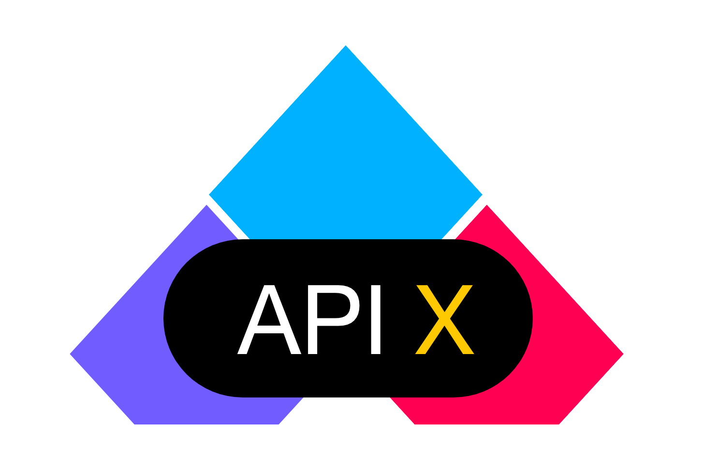

# API X

Create a full-fledged API only using a simple JSON file.


Give me all of the _____ for a particular _____.
EG: Give me all of the OrderIds for a particular Username;

### TODO
- [ ] Pagination
- [ ] Search
- [ ] 

#### Search
Search should be easy

```json
{ "name": "string|search:like" },
{ "description": "string|search:like_left" },
{ "description": "string|search:like_right" },
{ "uuid": "string|search:equal" },
```

#### Simple example
```json
{
    "name": "App",
    "version": "1.0",
    "description": "A demo application using the API library",
    "endpoint": "/api/v1.0/",
    "authentication": "token:device_user,api_key",
    "events": true,
    "db": {
        "driver": "dynamoDB",
        "prefix": "app_test_"
    },
    "servers": [
        {
            "url": "http://app.test"
        },
        {
            "url": "https://yelfxekak3.execute-api.eu-central-1.amazonaws.com/dev"
        }
    ],
    "api": [
        {
            "name": "device",
            "timestamps": true,
            "soft_deletes": true,
            "identifier": "uuid",
            "sort_key": "created_at",
            "per_page": 10,
            "fields": {
                "uuid": "string|primary|default:uuid",
                "device_id": "string:64|unique",
                "last_active_at": "datetime|index|on_update_fill:datetime",
                "device_user_id": "uuid|nullable",
                "api_key": "string|default:alphanumeric,36"
            },
            "relations": {
                "user": "belongsTo:device_user"
            }
        }
    ]
}
```

We currently support the normal laravel DB drivers including DynamoDB.

This definition will create an OpenAPI specification route plus a
migration for the device table including the endpoints for it.

All that needs to be done is to instantiate the API class.

## Install

You just need to require the composer package, and you're done.

```shell script
composer install envomer/php-laravel-api
```

## Instantiate
```php
// add this to config/app.php
    'providers' => [
        ...
        \API\APIServiceProvider::class,

// add the route (e.g. routes/web.php)
$api = new API\API(base_path('api.json'));
$api->setRoutes();
``` 

## Fake data

Since we have all the definition we need from the **api.json** file, it's also possible
to populate test data using the **faker** package.

## Serverless

It's very easy to get your entire app up and running withing minutes even without
setting up a server first. Here we'll use the AWS lambda functionality to handle
your code.

## Planned features

Use route syntax to fetch code from PHP instead of api.json. Eg:

```json
{
    "api": [
        "@App\\API\\DeviceAPI",
        "@App\\API\\UserAPI:getDefinition",
        {
            "name": "company",
            "fields": "@App\\API\\CompanyAPI:getFields"
        }
    ]
}
```

 
